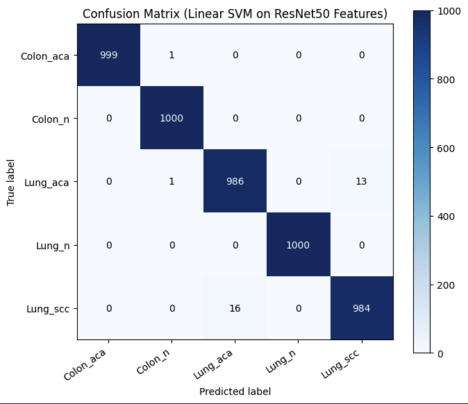
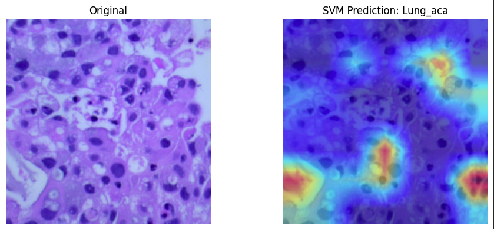

# Multi-Cancer Early Detection (LC25000)

Hybrid Deep Learning + Classical ML pipeline for 5-class histopathology classification on LC25000 (Lung + Colon).

## What This Project Does

This project uses a pretrained `ResNet50` as a **frozen feature extractor** and replaces its final classifier with `nn.Identity()` to obtain 2048-dimensional embeddings.  
A **linear SVM** (`SVC(kernel="linear", probability=True)`) is trained on these embeddings for final class prediction:

- `Colon_aca`
- `Colon_n`
- `Lung_aca`
- `Lung_n`
- `Lung_scc`

For interpretability, a separate ResNet50 classifier head is used with **Grad-CAM** on `layer4` to highlight regions supporting predictions.

## Model Evaluation

### Overall Metrics

- **Accuracy:** `99.38%`
- **Macro F1-score:** `0.9938`
- **Weighted F1-score:** `0.9938`

### Per-Class Metrics

| Class | Precision | Recall | F1-score | Support |
|---|---:|---:|---:|---:|
| Colon_aca | 1.0000 | 0.9990 | 0.9995 | 1000 |
| Colon_n | 0.9980 | 1.0000 | 0.9990 | 1000 |
| Lung_aca | 0.9840 | 0.9860 | 0.9850 | 1000 |
| Lung_n | 1.0000 | 1.0000 | 1.0000 | 1000 |
| Lung_scc | 0.9870 | 0.9840 | 0.9855 | 1000 |

### Raw Classification Report

```text
              precision    recall  f1-score   support

   Colon_aca     1.0000    0.9990    0.9995      1000
     Colon_n     0.9980    1.0000    0.9990      1000
    Lung_aca     0.9840    0.9860    0.9850      1000
      Lung_n     1.0000    1.0000    1.0000      1000
    Lung_scc     0.9870    0.9840    0.9855      1000

    accuracy                         0.9938      5000
   macro avg     0.9938    0.9938    0.9938      5000
weighted avg     0.9938    0.9938    0.9938      5000
```

## Evaluation Visuals

### Confusion Matrix



### Grad-CAM Example




## Notes

- The current metrics are excellent for this split, but medical AI should additionally validate patient-level splitting and external-domain generalization.
